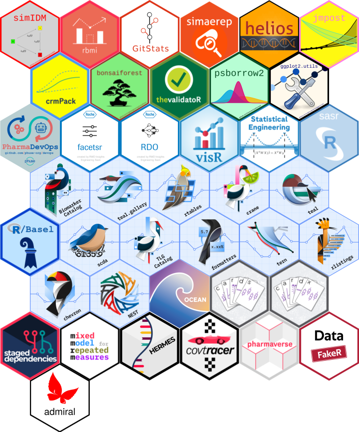

# Hex Stickers

Projects where we are involved.

## Adding stickers

To add one, make sure to add your hex sticker under the format
`EXACT_PACKAGE_NAME.FORMAT`

- where `EXACT_PACKAGE_NAME` is the exact name of your R package,
- and `FORMAT` is the file format of the hex sticker.

For example, if your package is called `BananaPudding`, and your hex
sticker is an SVG, then add `BananaPudding.svg` to the [SVG](SVG)
directory.

Then, simply run `rmarkdown::render("README.Rmd")` in R to render the
`README.md` file, as it will also automatically generate the hexwall and
the thumbnail(s) for your logo(s).

## Hex sticker wall

Hex details.

<table>
<tr>
<td>
 <a href="https://github.com/Roche-GSK/admiral">Roche-GSK/admiral</a>
 

ADaM in R Asset Library

<a href="PNG/admiral.png">admiral.png</a>
</td>
<td>
 chevron
 

This project is not tracked by openpharma.github.io

<a href="PNG/chevron.png">chevron.png</a>
</td>
<td>
 <a href="https://github.com/Genentech/covtracer">Genentech/covtracer</a>
 

Tools for contextualizing tests, built using covr test traces.

<a href="PNG/covtracer.png">covtracer.png</a>
</td>
</tr>
<tr>
<td>
 <a href="https://github.com/Roche/crmPack">Roche/crmPack</a>
 

Object-Oriented Implementation of CRM Designs

<a href="PNG/crmPack.png">crmPack.png</a>
</td>
<td>
 <a href="https://github.com/openpharma/DataFakeR">openpharma/DataFakeR</a>
 

DataFakeR is an R package designed to help you generate sample of fake
data preserving specified assumptions about the original one.

<a href="PNG/DataFakeR.png">DataFakeR.png</a>
</td>
<td>
 <a href="https://github.com/openpharma/facetsr">openpharma/facetsr</a>
 

This package is using html widgets to wrap facets into R

<a href="PNG/facetsr.png">facetsr.png</a>
</td>
</tr>
<tr>
<td>
 helios
 

This project is not tracked by openpharma.github.io

<a href="PNG/helios.png">helios.png</a>
</td>
<td>
 hermes
 

This project is not tracked by openpharma.github.io

<a href="PNG/hermes.png">hermes.png</a>
</td>
<td>
 mmrm
 

This project is not tracked by openpharma.github.io

<a href="PNG/mmrm.png">mmrm.png</a>
</td>
</tr>
<tr>
<td>
 nest
 

This project is not tracked by openpharma.github.io

<a href="PNG/nest.png">nest.png</a>
</td>
<td>
 pharmaverse
 

This project is not tracked by openpharma.github.io

<a href="PNG/pharmaverse.png">pharmaverse.png</a>
</td>
<td>
 psborrow2
 

This project is not tracked by openpharma.github.io

<a href="PNG/psborrow2.png">psborrow2.png</a>
</td>
</tr>
<tr>
<td>
 <a href="https://github.com/insightsengineering/rbmi">insightsengineering/rbmi</a>
 

Reference based multiple imputation R package

<a href="PNG/rbmi.png">rbmi.png</a>
</td>
<td>
 <a href="https://github.com/openpharma/RDO">openpharma/RDO</a>
 

Reproducible Data Objects (RDO) in R

<a href="PNG/RDO.png">RDO.png</a>
</td>
<td>
 <a href="https://github.com/Roche/rtables">Roche/rtables</a>
 

Reporting tables with R

<a href="PNG/rtables.png">rtables.png</a>
</td>
</tr>
<tr>
<td>
 <a href="https://github.com/openpharma/simaerep">openpharma/simaerep</a>
 

simulate adverse event reporting in clinical trials with the goal of
detecting under-reporting sites.

<a href="PNG/simaerep.png">simaerep.png</a>
</td>
<td>
 <a href="https://github.com/openpharma/staged.dependencies">openpharma/staged.dependencies</a>
 

R package to implement development stages for package development

<a href="PNG/staged.dependencies.png">staged.dependencies.png</a>
</td>
<td>
 StatisticalEngineering
 

This project is not tracked by openpharma.github.io

<a href="PNG/StatisticalEngineering.png">StatisticalEngineering.png</a>
</td>
</tr>
<tr>
<td>
 <a href="https://github.com/Roche/synthetic.cdisc.data">Roche/synthetic.cdisc.data</a>
 

No description in github

<a href="PNG/synthetic.cdisc.data.png">synthetic.cdisc.data.png</a>
</td>
<td>
 teal
 

This project is not tracked by openpharma.github.io

<a href="PNG/teal.png">teal.png</a>
</td>
<td>
 tern
 

This project is not tracked by openpharma.github.io

<a href="PNG/tern.png">tern.png</a>
</td>
</tr>
<tr>
<td>
 <a href="https://github.com/insightsengineering/thevalidatoR">insightsengineering/thevalidatoR</a>
 

Github Action that generates R Package Validation documentation 🏁

<a href="PNG/thevalidatoR.png">thevalidatoR.png</a>
</td>
<td>
 <a href="https://github.com/openpharma/visR">openpharma/visR</a>
 

A package to wrap functionality for plots, tables and diagrams adhering
to graphical principles.

<a href="PNG/visR.png">visR.png</a>
</td>
</tr>
</table>

# Acknowledgements

Code for this repo has been forked from `rstudio/hex-stickers` and
`mitchelloharawild/hexwall`. Copyright of the images is defined by the
sourced project (see source repo for hex-sticker)

## Stargazers

## Forkers

